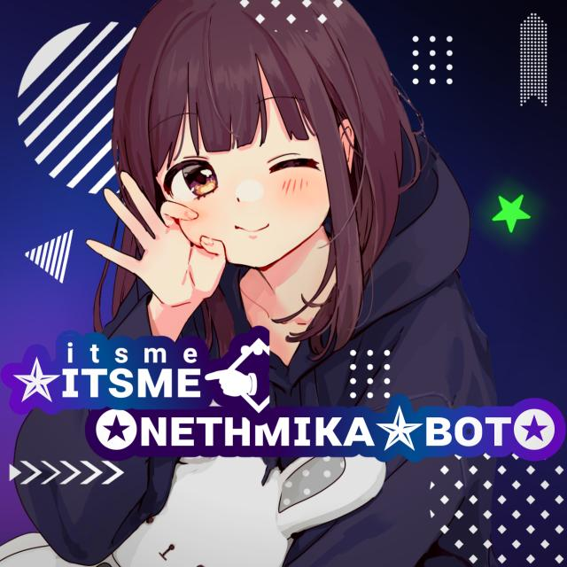

<h1 align="center"><b> 😇NETHMIKA An user bot for Whatsapp 😇</b></h1>

    Project of 😇 NETHMIKA - Makes it easy and fun to use Whatsapp. Also  Made in sri lanka.
     
        <a href="https://chat.whatsapp.com/HkqacSRVdDKBEaBX8GRaFs">Bot Group</a> |
        <a href="https://Wa.me/+94799536461">‍Nethmika.Broo Whatsapp </a> |
        
    < stay safe 😷 Enjoy Chatting in Whatsapp 👸>

  
  
  </a>
  

  
  
  </a>
  
  

  
  

### පහළ තිබෙන "Queen Mizuki Website" නම් බටනය click කර අපගේ වෙබ් පිටුවට පිවිසීමෙන් ඔබට පහසුවෙන් Mizuki deploy කරගත හැක.

---------------------------------   

###  Developer :- Nethmika.Broo

## Thanks To
- [@adiwajshinghttps://github.com/darshanamk) for coded [Me](https://github.com/darshanamk) 
- [@yusufusta](https://github.com/yusufusta/) for coded [Base Bot-Asena](https://github.com/yusufusta/WhatsAsena) 
- [@Me](https://github.com/darshanamk)  for all the helps 🤝
